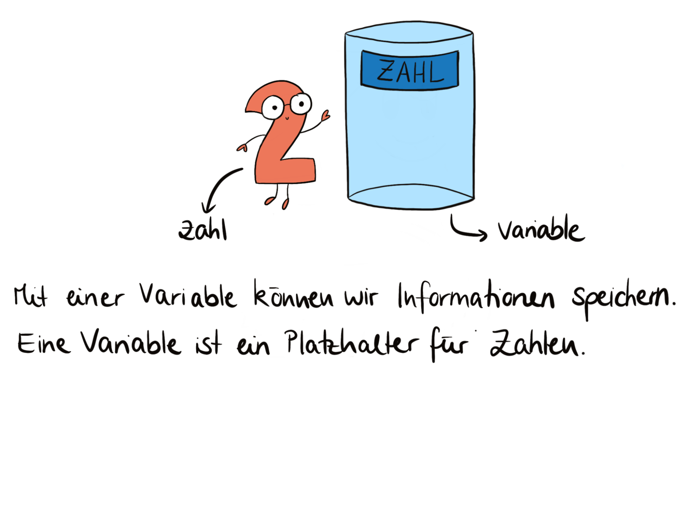
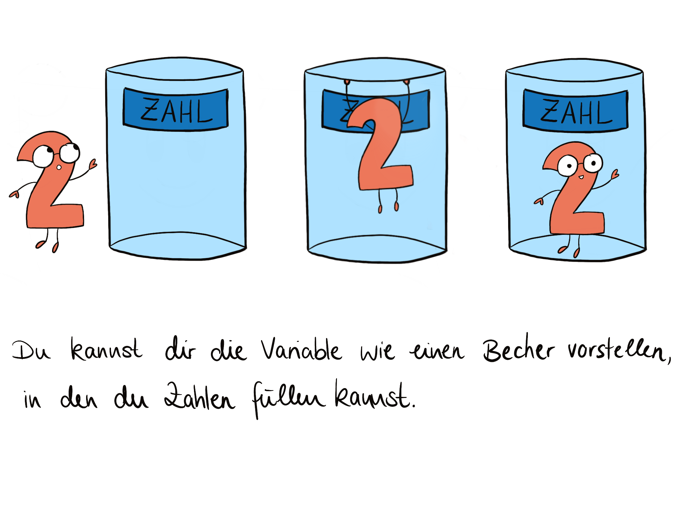

    

        

            Wie war das nochmal mit den Variablen?
            Hier ein Auszug aus unseren Lehrmaterialien!
        

    

 

        
    

    

        
    

     

            
     

     

            
     

     

            
     

    

    

        Variablen sind kein Problem für dich? Dann schau doch mal, ob du unser <a href="/puzzle">Puzzle</a></a> lösen kannst!
    

    

